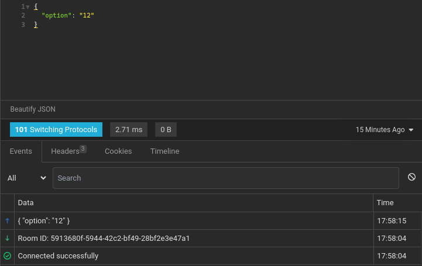
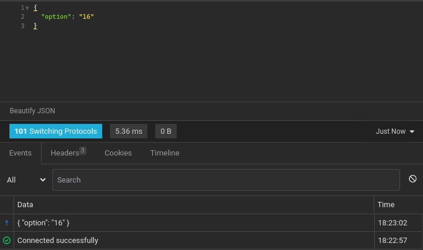
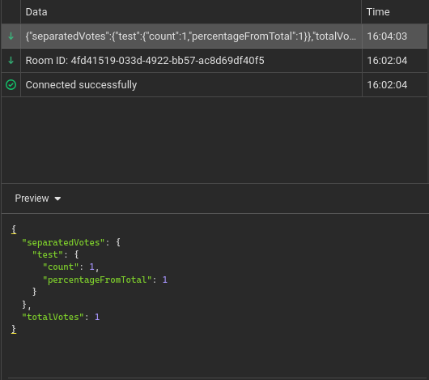

# Golang Voting System API

A Go API that uses websockets to handle voting

## Routes

#### Vote

 
<code>GET</code> <code><b>/vote</b></code> <code>(creates a room and enter as voter)</code>

##### JSON Body Params

> | name   | type     | data type |
> | ------ | -------- | --------- |
> | option | required | string    |

 
<code>GET</code> <code><b>/vote/:roomId</b></code> <code>(enters in a room as voter)</code>

##### JSON Body Params

> | name   | type     | data type |
> | ------ | -------- | --------- |
> | option | required | string    |

#### Spectate

 
<code>GET</code> <code><b>/spectate</b></code> <code>(creates a room and enter as spectator)</code>

 
<code>GET</code> <code><b>/spectate/:roomId</b></code> <code>(enters in a room as spectator)</code>

